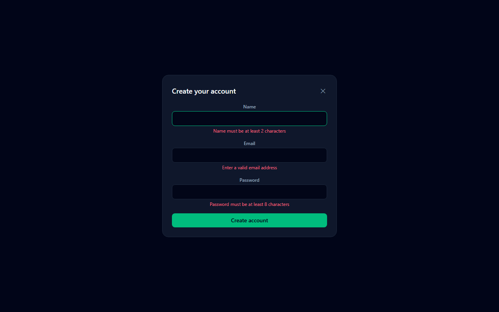

# Modal + Form Component Toolkit

A small, focused set of reusable UI primitives — an accessible Modal and a validated form field — proven out with real unit tests, not just eyeballed in the browser.

**Live demo:** _add your deployed URL here_



## What it does

- **`Modal`** — closes on Escape, closes on backdrop click (but not on clicks inside the dialog), auto-focuses its close button on open, and exposes `role="dialog"` / `aria-modal` / `aria-labelledby` for screen readers.
- **`TextField`** — a `forwardRef` input that correctly associates its `<label>` via `htmlFor`/`id` (so `getByLabelText` and screen readers both work), and wires `aria-invalid` / `aria-describedby` to its error message.
- **`SignupForm`** — composes both, using React Hook Form + Zod for schema-based validation, to show the components doing real work rather than existing in isolation.

## Why this exists

Most portfolio projects skip tests entirely. This one is deliberately small so the tests can be the point: 10 unit tests across the Modal, the TextField, and the form's validation behavior, run with Vitest + React Testing Library.

## Stack

- React 19 + Vite
- Tailwind CSS 4
- React Hook Form + Zod
- Vitest + React Testing Library + `@testing-library/user-event`

## Running locally

```bash
npm install
npm run dev     # demo app
npm run test    # run the test suite once
npm run test:watch
```

## What I learned

Testing the Modal's backdrop-click behavior forced a real decision, not just a happy-path test: the handler has to check `event.target === event.currentTarget`, or clicking anywhere inside the dialog (which bubbles up through the backdrop's own click handler) would close it. Writing the test first made that bug obvious before it ever reached the browser.
